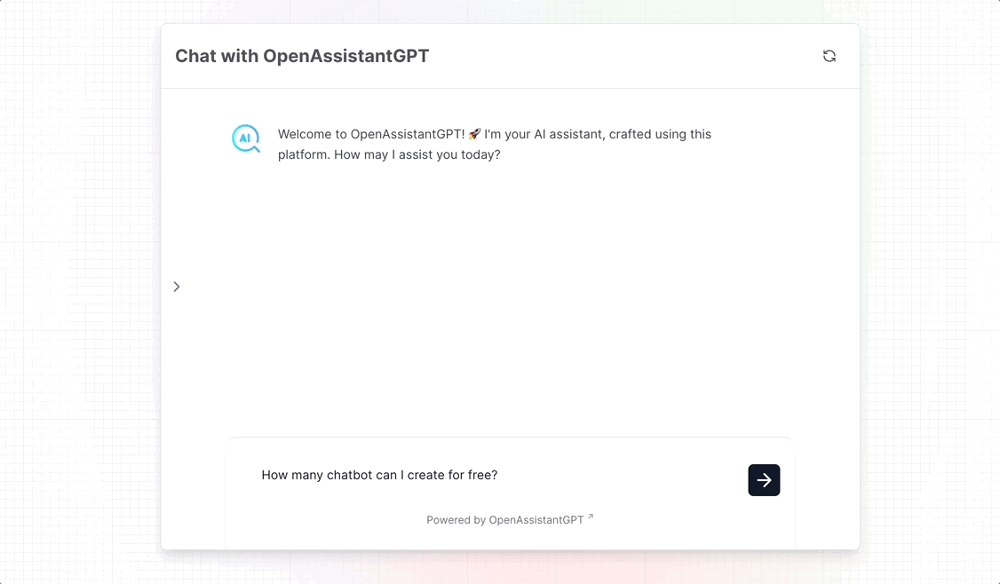

# OpenAssistantGPT SDK

This SDK is an extension of the vercel/ai SDK with more features, addapted to our use case and maintained by the OpenAssistantGPT team.
If you want more information about OpenAssistantGPT you can find it [here](https://www.openassistantgpt.io/).

We also provide our chatbot with our [hosted version](https://www.openassistantgpt.io/), with adavanced analytics, crawling for custom content and advanced security.

# Deploy example

Deploy our basic example using [Vercel](https://vercel.com):

[](https://vercel.com/new/clone?repository-url=https%3A%2F%2Fgithub.com%2FOpenAssistantGPT%2FOpenAssistantGPT-SDK%2Ftree%2Fmain%2Fexamples%2Fnext-website&env=OPENAI_ASSISTANT_ID,OPENAI_API_KEY&envDescription=Find%20all%20informations%20in%20OpenAI%20Platform.&envLink=https%3A%2F%2Fplatform.openai.com%2F)

For more information about the example give a look at this [README.md](https://github.com/OpenAssistantGPT/chatbot-sdk/tree/main/examples/next-website#openassistantgpt-sdk-nextjs-and-openai-chat-example).

All examples

- [Basic Website](./examples/next-website/README.md)
- [Window Style Integration](./examples/website-chatbot-window/README.md)
- [Custom API](./examples/website-custom-api//README.md)

# Installation

You will need Node.js 18+ and pnpm install on your local development machine.

```bash
npm install @openassistantgpt/assistant
npm install @openassistantgpt/ui
```

# Usage

## @openassistantgpt/assistant

First you need to import our library and configure the POST and GET method. This will setup the backend correctly.

```bash
npm install @openassistantgpt/assistant
```

Then you have to setup you environment variables by creating your `.env` file

```
OPENAI_API_KEY=xxxxxxx
OPENAI_ASSISTANT_ID=xxxxxx
```

Once the package is installed and your environment variables are configured create the route file `/api/chat/[[...openassistantgpt]]/route.ts`

```js
import { OpenAssistantGPT } from '@openassistantgpt/assistant';

// In OpenAssistantGPT handler you must enter your base path.
// The base path is everything before the [[...openassistantgpt]] part of the route.
const httpHandler = new OpenAssistantGPT('/api/chat/').handler;

export { httpHandler as GET, httpHandler as POST };
```

## @openassistantgpt/ui

First you need to import our library and configure your component to use it.

```bash
npm install @openassistantgpt/ui
```

Once the UI package is installed create the `page.tsx` file and configure your chatbot like you want.

```js
'use client';

import { OpenAssistantGPTChat, ChatbotConfig } from '@openassistantgpt/ui';

export default function ChatPage() {
  const chatbot: ChatbotConfig = {
    id: '12345',
    name: 'OpenAssistantGPT',

    chatTitle: 'Chat with OpenAssistantGPT',
    welcomeMessage:
      "Welcome to OpenAssistantGPT! 🚀 I'm your AI assistant, crafted using this platform. How may I assist you today?",
    chatMessagePlaceHolder: 'Ask us any question...',

    rightToLeftLanguage: false,

    bubbleColor: 'linear-gradient(to top left, #003366, #336699)',
    bubbleTextColor: '#FFFFFF',

    chatHeaderBackgroundColor: '#FFFFFF',
    chatHeaderTextColor: '#52525b',

    chatbotReplyBackgroundColor: '#e4e4e7',
    chatbotReplyTextColor: '#000000',

    userReplyBackgroundColor: '#e4e4e7',
    userReplyTextColor: '#000000',

    chatbotLogoURL:
      'https://gwetfkan2dovfoiz.public.blob.vercel-storage.com/search-8jZhOvOBPxuTmohrup5TPvSzrjsyog.png',
    chatInputStyle: 'default',

    chatHistoryEnabled: true,
    chatFileAttachementEnabled: true,

    displayFooterText: true,
    footerLink: 'https://www.openassistantgpt.io',
    footerTextName: 'OpenAssistantGPT',
  };

  return (
    <OpenAssistantGPTChat
      chatbot={chatbot}
      path="/api/chat/assistant"
      defaultMessage=""
    />
  );
}
```

## Community

The OpenAssistantGPT SDK community can be found on [GitHub Discussions](https://github.com/OpenAssistantGPT/OpenAssistantGPT-SDK/discussions) where you can ask questions, voice ideas, and share your projects with other people.

## Contributing

Contributions to the OpenAssistantGPT SDK are welcome and highly appreciated. However, before you jump right into it, we would like you to review our [Contribution Guidelines](https://github.com/OpenAssistantGPT/OpenAssistantGPT-SDK/blob/main/CONTRIBUTING.md) to make sure you have smooth experience contributing to OpenAssistantGPT SDK.

## Authors

OpenAssistantGPT team members, with contributions from the [Open Source Community](https://github.com/OpenAssistantGPT/OpenAssistantGPT-SDK/graphs/contributors).
